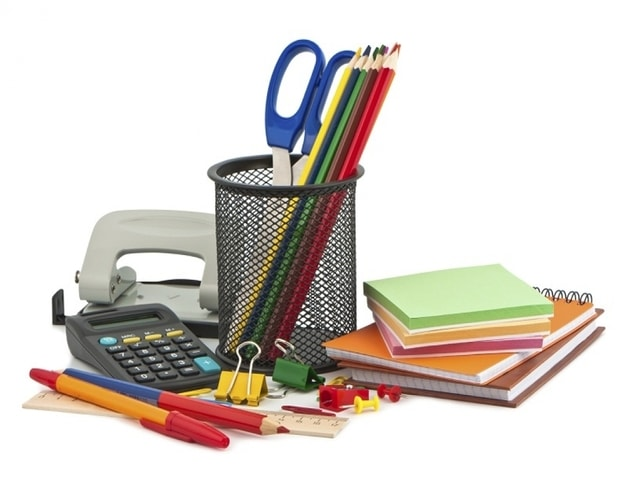
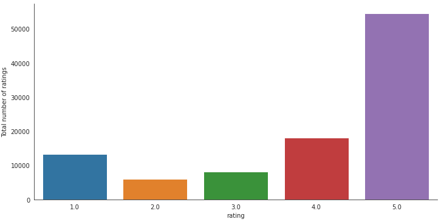

# Office Supplies Recommendation System
Author: Volha Puzikava
***

## Disclaimer
The described analyses fulfill educational purposes only. The hypothetical business case, made-up data and the results of the performed analyses should not be considered as real recommendations of the seller, and have not been approved by any professional organization or trading company.
***

## Overview
With the rise of technology, people shop online more and more often. But with the beginning of new school year, people use online shopping even more frequently. According to the [National Retail Federation’s annual survey](https://nrf.com/media-center/press-releases/back-school-and-college-spending-reach-828-billion), online retailers are the most popular shopping destination for back-to-college shoppers. More than 50% of consumers shop online for back-to-school items every year. Parents spend record amounts of money to get their kids ready for school.

Companies are also big customers in the office supply world. A company with 1-4 employees has an average office supply cost of up to $1,844 per employee, per year. A well-stocked, uncluttered and organized office is a successful office. The availability of necessary office supplies in the office can minimize downtime and maximize productivity. However, not all employers know exactly what products to provide in order to smooth the working process and make it more efficient.

This project tends to recommend office supplies to the customers based on the reviews that were left by the same customers for the previously bought products. Thus, the project does not only help the retailers in providing high level of personalization and customer tailored services, but also the customers in saving their time and energy. The project also answers the question if it is reasonable for the sellers to offer products in double quntities. 
***

## Business Problem
The Stationary and Co. Company asked to develop a recommendation system of their office supply products in order to reach more sales while providing a high level of presonalization to their customers. The project also answers the question, if it is worth for the company to offer customers their products in the pack of two instead of one.
***

## Data Understanding
The data for the analysis was taken from [Amazon review data (2018)](http://deepyeti.ucsd.edu/jianmo/amazon/index.html) page. The dataframes contained reviews and meta data for office supply products sold on Amazon from 2014 to 2018. The data included 5,581,313 reviews and 315,644 products.
***

## Data Preparation and Exploration
The data was uploaded and analyzed. The columns' names were renamed and the dataframes were merged together on product_ID column. Any missing values and duplicates were dropped. Two dataframes were created from the cleaned data. One dataframe contained ratings, product IDs and reviewers IDs, while the other had titles, category type and product IDs. From the first dataset 100,000 random rows were chosen for further analysis. The second dataset was cleaned again by dropping any existing duplicates (duplicates were formed because different users left reviews for the same products). The datasets were saved as csv files.

The distribution of ratings in the rating dataset was plotted. As seen from the graph, people mostly left 5 stars to the products presented on the web site, and 4 and 1 star reviews are almost equally distributed. 

***

## Data Modeling
The recommendation system was initially built using surprise library. Different types of collaborative filtering engines, ranging from neighborhood-based methods to matrix factorization, were tried out. Later, the recommendation system was built using ALS in Spark programming environment. The different models were compared to see which one performed better. For consistency sake, RMSE was used to evaluate the models.

### Modeling with Surprise Library
The number of users and items were checked in the dataset. It helped to determine whether user-user or item-item similarity should be performed. Since there was fewer items, it was more efficient to calculate item-item similarity.

### Matrix Factorization (Model-Based Method)

#### Singular Value Decomposition (SVD)
Singular-Value Decomposition or SVD is a common and widely used matrix decomposition method. SVD is the factorization of a matrix into 3 matrices: two orthogonal matrices and one nonnegative rectangular diagonal matrix. SVD decreases the dimension of the matrix by extracting its latent factors.

Grid search was implemented to expedite the process of trying out different parameters. The parameter n_jobs was set to -1 to ensure that all of the cores on the computer would be used to process fitting and evaluating all of the models.

It turned out that the best parameters were n_factors of 20 and a regularization rate of 0.02 that yielded the RMSE value of 1.366.

### Neighborhood-Based Methods (Memory-Based)
Pearson correlation was used as a similarity metric. Cross-validatoin was performed to determine the optimal model.

#### KNN Basic Model
KNN approache involves finding the top K nearest neighbors for an item. Ratings from the list of nearest neighbors are combined to predict the unknown rating. This involves finding of all item-item correlations.

KNN Basic model yielded RMSE value of 1.431.

#### KNN Baseline Model
This is a more advanced method because it adds a bias term that is calculated by the way of minimizing a cost function. The model had RMSE of 1.370.

#### KNN with Means Model
The model takes into account the mean rating of each item. The model yielded RMSE of 1.433.

Based off the resulted outputs, it seemed like the best performing model was the SVD model with n_factors equal to 20 and a regularization rate of 0.02. The model had a RMSE of about 1.366 (lowest among the models), meaning that it was off by roughly 1 point for each guess it made for ratings. The SVD model was used to make predictions.

Since the goal of the project was to create recommendations specifically tailored to the customers' preferences, the first step was to create a function that would allow to pick randomly selected products and ask the customers to rate them. If the customers had never used the products, they would be able to skip rating them. After that, ten recommendations for the new user were made based on the new ratings left by the same user.
<video src='Images/video1670210028_AdobeExpress.gif' width=180/>

### Modeling in PySpark
The saved datasets were used to build a recommendation system using the collaborative filtering technique with Spark's Alternating Least Squares implementation.

#### Alternating Least Squares
SparkSession object was initialized and the rating dataset was imported. Since reviewer_ID and product_ID columns were of a string type, StringIndexer had to be used. StringIndexer encoded string columns of labels to columns of label indices. After the application of StringIndexer, the ALS model was fit on the training set, the model was evaluated and RMSE of the test set was printed out.

Although the RMSE value of the ALS model was much higher than the RMSE of the SVD model (4.209), the predictions were still made. ALS is good for large-scaled collaborative filtering problems and slightly different from SVD. Spark attempts to offer a somewhat abstracted approach to the development of algorithms within a distributed computing environment, but it performs much slower.

Before making any recommendations in Spark, the function that took in product_Index and returned a string that represented the product_ID was created. After that the dataset with meta data was imported into a Spark DataFrame. The function that returned the product_ID as a product title was formed. Also, a function that took in a new user and some products the user had rated and then returned 10 highest recommended products was created.

### A/B Testing
The Stationary and Co. Company also asked to design an experiment to test whether it would be more effective for the company's marketing team to offer their products in a pack of two instead of just one. The company said if they had an absolute increase in the buying rate of just 5%, it'd be worth making the change. The company also mentioned that the experiment could be run for a month since they needed to make a decision fast enough before the beginning of a new school year. The company said they had about 6.5 million unique visitors per day and around 25% of them buy some product every day.

It turned out the [standard deviation]( https://www.macroaxis.com/invest/technicalIndicator/AMZN/Standard-Deviation) of the company is 2.74. Since the current buying rate is 25% and 5% rate increase is what the company is looking for, the following hypotheses can be stated:

* Null Hypothesis: the probability of success for the new pack is < 0.3
* Alternative Hypothesis: the probability of success for the new pack is >= 0.3

A power analysis was performed to find the minimum number of samples needed to see an increase of 5% from 25% if a typical power of 0.8 and a conservative alpha of 0.01 were chosen.

It turned out that the minimum number of customers needed for the experiment was 60,279.

Two groups participated in the experiment: a control group that had no change in the amount of packed product and an experiment group that had the updated package. About a month's worth of data for the control and experiment groups was collected (the data was made-up). The data was aggregated in separate files for the two groups. The files contained 28 days with the number of bought products recorded for each day.

The data was visualized. Since the frequency of bought products was of interest, the chi-square goodness-of-fit test was used. The first step was to get the data into a format of "observed" (experiment) vs "expected" (control). Then  the Chi-Square Goodness of Fit Test using the chisquare function from the SciPy library was performed.

Since the p-value was less than 0.01, the null hypothesis was rejected. We're 99% confident that there was an observable effect in buying rate by changing the quantity in the pack of the products. The difference in package was observed to decrease the buying rate by an absolute amount of about 6.25%. This change cannot be made valuable since we are confident that the effect was real.
***

### Evaluation
Thus, it was possible to conclude that the best model for the recommendation system was the SVD model with the lowest RMSE value of 1.366. That model was off by roughly 1 point for each guess it made for ratings. The Singular-Value Decomposition is a matrix decomposition method for reducing a matrix to its constituent parts in order to make certain subsequent matrix calculations simpler. The method is faster and more stable than other methods.

The A/B Testing showed that the change in the package of the products (pack of two instead of one) would decrease the buying rate by about 6.25%. Thus, we can confidently conclude, that the mentioned change will not be worth to implement.
***

### Conclusions
Thus, for the Stationary and Co. Company we can advise to use the SVD model for the recommendation system of their office products in order to provide a high level of presonalization to their customers. As concerns the change in the package quantity, we are 99% confident that there is an observable effect in buying rate if the changes are made. However, offering a pack of two instead of one will decrease the buying rate by about 6.25%. Thus, we can advise not to implement any changes in the package quantity.

Of coarse, the models are not ideal and more digging can be beneficial. Thus, we can try to tune the ALS model and see if it can work any better. As concerns the A/B testing, the company should come out with some other ideas how to increase sales, like changing the website by making it more user-friendly or just offering discounts on the customers' birthdays...
***

### Reproduction Instructions
This project uses:

* [Anaconda](https://www.anaconda.com), a package and environment management tool
* Python 3.8.5, with the following additional packages/libraries:
  * Pandas 1.1.3
  * NumPy 1.18.5
  * Matplotlib 3.3.1
  * Seaborn 0.11.0
  * Scikit-Learn 0.23.2
  * Scikit-Surprise 1.1.1
  * PySpark 3.0.0
  
If you would like to follow the analysis locally and have the above tools:
* Fork and clone this repository.
* Go to the [Amazon review data (2018)](http://deepyeti.ucsd.edu/jianmo/amazon/index.html) page and download the data files.
* You should then be able to run the analysis in the provided [Office_Supplies Jupyter Notebook](https://github.com/VolhaP87/Office_Supplies_Recommendation_System/blob/main/Office_Supplies.ipynb).
***

### Sources
* [Amazon review data (2018)](http://deepyeti.ucsd.edu/jianmo/amazon/index.html) page
* [Recommendation System Presentation](https://github.com/VolhaP87/Office_Supplies_Recommendation_System/blob/main/Recommendation%20System%20Presentation.pdf)
***

### Contact Information
With questions or feedback on this repository, please reach out via:
* [GitHub](https://github.com/VolhaP87?tab=repositories)
* [LinkedIn](https://www.linkedin.com/in/volha-puzikava-2319294a/)